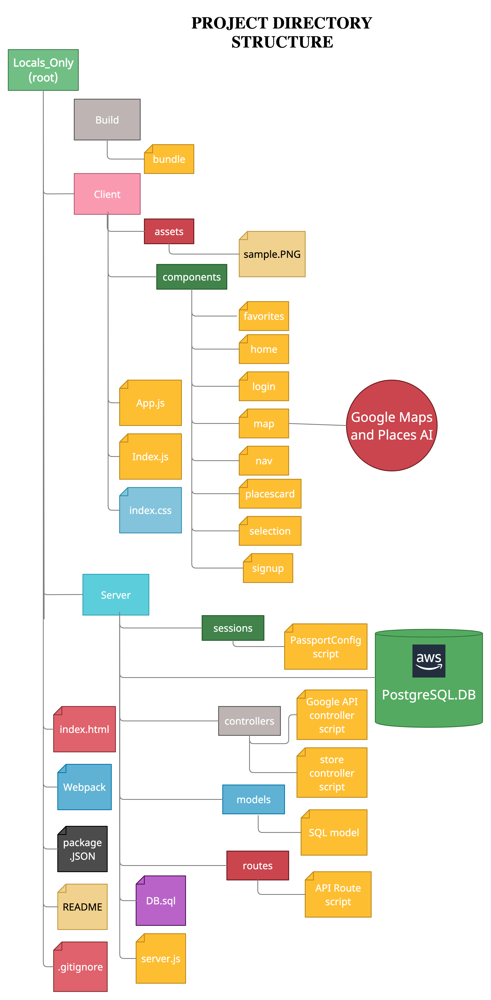
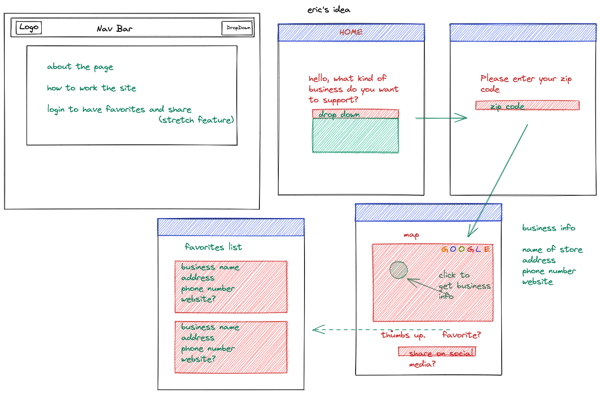
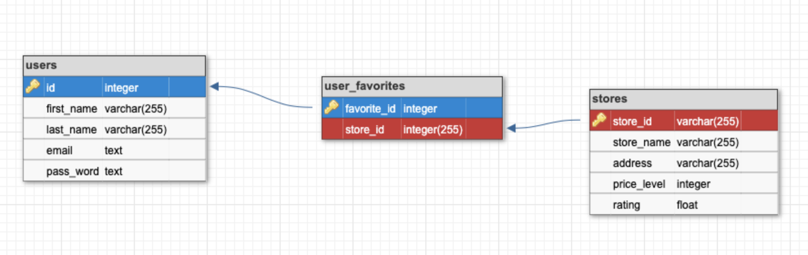
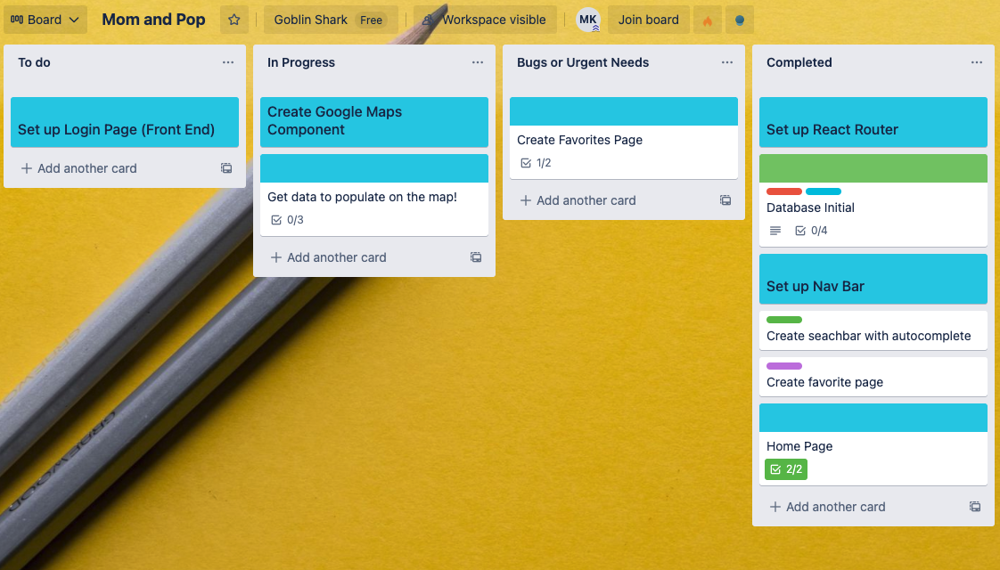

# locals_only

    

<h1 align ="center">Locals Only</h1>

A place for people to find only local businesses they want where they are.

<h2 align="center">Table of Contents</h2>

* [FolderStructure](https://github.com/GoblinShark2021/momandpop/#FolderStructure)
* [Wireframe](https://github.com/GoblinShark2021/momandpop/#Wireframe)
* [Database Structure and Overview](https://github.com/GoblinShark2021/momandpop/#Database)
* [Google Maps API Usage Information](https://github.com/GoblinShark2021/momandpop/#GoogleAPI)
* [Collaboration Approach: Scrum](https://github.com/GoblinShark2021/momandpop/#Scrum)
* [Contributors](https://github.com/GoblinShark2021/momandpop/#Contributors)
* [License](https://github.com/GoblinShark2021/momandpop/#License)

<h2 href="#FolderStructure"  >File System Folder Structure</h2>

We used <a href="https://creately.com/" target="_blank">Creatly</a> to create our folder structure.  We are linking it here to display my thought process for this SPA.

<h2 href="#Wireframe"  >Wireframe</h2>

We used <a href="https://excalidraw.com/" target="_blank">Excalidraw</a> to create a wireframe.  We are linking it here to display our thought process for this SPA.

<h2 href="#Database" >Database Structure and Overview</h2>

We used <a href="https://app.dbdesigner.net/" target="_blank">DB Designer</a> to create a database schema and structure.  We are linking it here to display our SQL Database relationships and overview..

<h2 href="#GoogleAPI" >Google Maps API Usage Information</h2>

The <a href="https://developers.google.com/maps/documentation/places/web-service/overview">Google places API</a> and <a href="https://developers.google.com/maps/documentation/javascript/overview">Google Maps API</a> is what was utilized in this project. We layered Google places to set our markers on top of the map. The search box with autocomplete utilized a live update as the user searched for the location. The user is able to select a type of store and proximity radius to the selected location.

Once the map renders the icons from our web application the user is able to select favorites. When the user selects favorite they will be able to see their favorite stores on the favorite portion of the website.

<h2 href="#Scrum" >Collaboration Approach: Scrum with Trello Boards</h2>

We used a <a href="https://trello.com/">Trello</a> board to collaborate using the scrum method.  We separated teams into front and back end.  We created cards with tasks that needed to be completed.  We commented and updated each other on these cards when we weren't able to meet.  We moved our cards into different lists that let the team know where each overall task was in the project timeline.  We had standups in the beginning of the day and the end to go over any progress, issues, and to project future tasks required for our minimum viable product.  
    
    

<h2 href="#Contributors" >Contributors</h2>

<table >
  <tr>
    <td valign="top"> </td>
    <td valign="top"> </td>
    <td valign="top"> </td>
    <td valign="top"> </td>
  </tr>
  <tr>
      <td valign="top"><h2 align="center">Eric Saldivar</h2></td>
      <td valign="top"><h2 align="center">Charles Malave</h2></td>
      <td valign="top"><h2 align="center">Cameron Walls</h2></td>
      <td valign="top"><h2 align="center">Miklos Kertesz </h2></td>
  </tr>
   <tr>
      <td align="center"></td>
      <td align="center"></td>
      <td align="center"></td>
      <td align="center"></td>
  </tr>
</table>
<h2 href="#License" >License</h2>

This product is licensed under the MIT License.

<h3 align="left">Languages and Tools:</h3>

 
       </a>  
  

